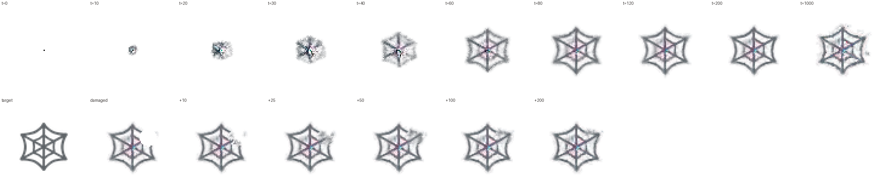
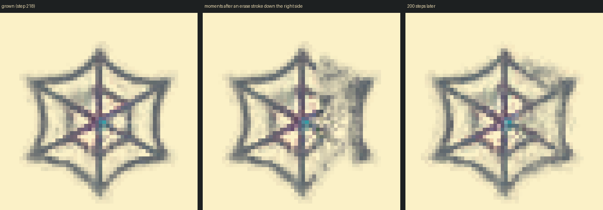

# NCA Morphogenesis

A neural cellular automaton (NCA) that grows a pattern from a single cell, maintains it,
and regrows it after damage, plus a live web sandbox where you can wound the organism,
inject noise and build walls while it runs. Based on
[Growing Neural Cellular Automata](https://distill.pub/2020/growing-ca/)
(Mordvintsev et al., Distill 2020). The default target is the 🕸 spider-web emoji
from Google's Noto Color Emoji font.



*Top: growth from a single seed cell. Bottom: the target, then a randomly wounded
pattern regrowing. Made with `tools/evaluate.py` and the bundled starter model.*

## Features

- **Model**: a lightweight PyTorch NCA. Each cell has 16 channels and perceives its
  neighbours through fixed identity and Sobel filters. A small network shared by all
  cells, two 1×1 convolutions with 8,320 parameters in total, computes each cell's
  update. Living cells update at random times, and a cell dies when no cell in its 3×3
  neighbourhood (itself included) is mature, meaning alpha above 0.1.
- **Training**: grows a target image from one seed pixel. It uses a persistent sample
  pool, and damages samples during training by erasing discs and by injecting noise,
  so the model learns to heal both.
- **Simulation engine**: a fixed-rate server loop that advances the grid frame by frame,
  on PyTorch (CPU, CUDA or Apple MPS) or a NumPy fallback, with walls and brush edits
  applied between steps.
- **Sandbox**: a browser canvas streamed over WebSockets. Erase, inject noise, paint or
  remove walls, and plant extra seeds; pause, single-step, change speed, and switch
  between the RGBA, hidden-channel and alive-mask views.

## Quick start

```bash
python -m venv .venv && source .venv/bin/activate     # Windows: .venv\Scripts\activate
pip install -r requirements.txt
python server.py                                       # then open http://localhost:8000
```

The sandbox loads `checkpoints/spiderweb_starter.npz` by default. With PyTorch installed
it runs on PyTorch (CUDA when available, otherwise CPU; pass `--device mps` on Apple
silicon), otherwise on NumPy. Both implement the same update rule. To run only the
sandbox, without PyTorch, `pip install numpy starlette "uvicorn[standard]"` is enough.

## Train a model

```bash
python -m nca.train --out checkpoints/spiderweb.npz             # uses a GPU if one is available
python tools/evaluate.py --checkpoint checkpoints/spiderweb.npz  # growth, stability, regrowth, noise
python server.py --checkpoint checkpoints/spiderweb.npz
```

The defaults follow the Distill "regenerating" experiment: a 40 px target with 16 px of
padding (a 72×72 grid), 16 channels, 128 hidden units, fire rate 0.5, a pool of 1,024
samples, batch 8, 64-96 steps per rollout, Adam at 2e-3 dropping to 2e-4 after 2,000 of
8,000 iterations, and per-tensor gradient normalisation.

One deliberate difference: Distill erases a disc from 3 samples per batch. Here, 2
samples get a disc erased and 2 more get Gaussian noise (standard deviation 0.1-0.6) on
the living cells inside a disc. The sandbox lets users inject noise, and a model trained
only on erasure does not recover from it (see [Starter model](#starter-model)).
`--damage 3 --noise-damage 0` gives the original Distill damage recipe.

A second small difference: only cells that are alive at the start of a step may update.
In the Distill code every cell adds its update and dead cells are cleared only at the
end of the step, so an empty cell's momentary update can keep a neighbour alive. Here
that cannot happen, and the PyTorch model, the NumPy version and the bundled checkpoint
all use the same rule (`tests/test_torch_parity.py` checks it).

| flag | what it does |
|---|---|
| `--target path.png` | any RGBA image with a transparent background |
| `--damage N` / `--noise-damage N` | samples per batch erased / noised (both 0 = growing only) |
| `--noise-std lo,hi` | range of the training noise strength |
| `--init model.npz` | start from existing weights (fine-tuning); iteration counts carry over |
| `--resume run.pt` | continue a run; the `.pt` holds weights, optimiser, schedule and pool |
| `--grad-checkpoint` | recompute activations in the backward pass; much less GPU memory |
| `--device cpu\|cuda\|mps` | defaults to the first available |

With `--out checkpoints/spiderweb.npz`, training writes the following to `checkpoints/`:

- `spiderweb.npz`: the weights the simulator loads.
- `spiderweb.pt`: the full training state, for `--resume`.
- `spiderweb_log.json`: the loss at every iteration.
- `spiderweb_previews/`: a PNG of the batch every `--log-every` iterations.

**On Colab:** upload the zip, switch to a GPU runtime, and run
`!unzip -q nca-morphogenesis.zip && cd nca-morphogenesis && pip install -r requirements.txt && python -m nca.train`.

`tools/train_numpy.py` is a NumPy version of the same trainer, with a hand-written
backward pass. It is slow, but it needs no PyTorch and is useful for checking the maths.

## Tests

```bash
python tests/test_torch_parity.py   # PyTorch model == NumPy reference (forward pass and gradients)
python tests/test_gradients.py      # NumPy backward pass vs finite differences
python tests/test_engine.py         # engine, brushes, protocol, WebSocket endpoint
python tests/test_training.py       # noise damage and fine-tuning in the NumPy trainer
```

With pytest installed, `python -m pytest tests -s` runs them all. Run the parity test
before a long training run.

## How the project meets the brief

| requirement | where |
|---|---|
| **NCA architecture**: cellular update rules as a lightweight 2-D conv net in PyTorch | `nca/model.py`: fixed depthwise perception (identity, Sobel x/y), two 1×1 convs (48 → 128 → 16, last layer zero-initialised), stochastic per-cell updates, alive masking on alpha |
| **Training**: grow from one seed pixel with a persistent sample pool and random damage | `nca/train.py`: pool of 1,024, worst sample reseeded, the best get a disc erased (2) or noised (2), backpropagation through 64-96 steps |
| **Simulation engine**: frame-by-frame grid updates, state persistence, temporal flow | `sim/engine.py` (grid state, walls, brushes, PyTorch or NumPy backend) and the fixed-rate loop in `server.py` (pause, single step, steps per frame) |
| **Interactive sandbox and transport**: real-time canvas over WebSockets; inject noise, paint obstacles, erase | `server.py` (Starlette WebSocket), `sim/session.py` (protocol), `web/` (canvas client) |

## Sandbox

| tool | key | effect |
|---|---|---|
| Erase | `E` | zeroes every channel under the brush (a wound) |
| Noise | `N` | adds Gaussian noise to all channels of living cells under the brush (strength = standard deviation) |
| Wall | `W` | paints obstacles: cells forced to zero after every step, so growth has to route around them |
| Unwall | `U` | removes obstacles |
| Seed | `S` | plants a new seed cell where you click, to grow a second organism |

| key | action |
|---|---|
| `Space` | pause / resume |
| `.` | single step |
| `R` | reset to a single seed |
| `D` | erase a random disc over the organism |
| `[` `]` | smaller / larger brush |
| `1` `2` `3` | RGBA view / hidden channels 4-6 as colour / alive mask |

"Steps per frame" sets the simulation speed, and the server streams up to 30 frames per
second (`--fps`). Each browser tab gets its own simulation. Server flags: `--checkpoint`,
`--size` (grid, default 96), `--fps`, `--steps-per-frame`, `--backend auto|torch|numpy`,
`--device`, `--host`, `--port`.

### Wire protocol

Client to server, as JSON text:

- `stroke {tool, points: [[x, y], ...], radius, strength}`
- `pause {value}`, `step {n}`, `speed {steps_per_frame}`, `view {mode}`
- `reset`, `clear`, `clear_walls`, `damage`

Coordinates are in cells and may be fractional, and the client interpolates drags so
strokes have no gaps. Malformed messages get an `error` reply and never end the session.

Server to client:

- a JSON `hello` with the grid size, backend and checkpoint metadata;
- JSON `stats` twice a second;
- one binary frame per tick: a 16-byte header (`NCA1`, step, H, W, view, flags), then
  H×W×4 RGBA bytes with premultiplied colour, then a bit-packed wall mask.

The exact byte layout is documented in `sim/session.py`.

## Project layout

```
nca/model.py          PyTorch NCA (perceive -> update -> stochastic fire -> alive mask)
nca/train.py          PyTorch trainer: pool, erase and noise damage, BPTT, export
nca/numpy_nca.py      the same update rule in NumPy (simulator fallback, reference trainer)
nca/checkpoint.py     framework-neutral .npz weight format shared by everything
nca/target.py         target loading (premultiplied RGBA + padding)
sim/engine.py         grid state, obstacles, brushes, backends
sim/session.py        per-connection protocol and frame encoding
server.py             Starlette app: static client + /ws stream loop
web/                  canvas client (index.html, app.js, style.css)
tools/train_numpy.py  NumPy trainer with a hand-written backward pass
tools/evaluate.py     growth / stability / regeneration / noise metrics and filmstrips
tests/                parity, gradient, engine/server and training tests
docs/                 sandbox screenshot
data/                 spiderweb_128.png target, rendered from Noto Color Emoji (SIL OFL 1.1)
checkpoints/          spiderweb_starter.npz, its training log and evaluation
```

## Starter model

`checkpoints/spiderweb_starter.npz` was trained with `tools/train_numpy.py` for 4,000
iterations, half the Distill schedule, using the original erase-only damage
(`--damage 3 --noise-damage 0`). The numbers below come from one run of
`python tools/evaluate.py`; they are mean squared error against the target, and vary a
little with the random seed.

| state | MSE |
|---|---|
| empty grid | 0.0296 |
| after 60 / 80 / 200 growth steps | 0.0092 / 0.0032 / 0.0027 |
| left running: step 500 / 1,000 / 2,000 | 0.0028 / 0.0039 / 0.0055 (step 2,000 needs `--long 2000`) |
| 8 random wounds: just after, then +50 and +200 steps (median) | 0.0055, 0.0035, 0.0030 |



The web grows in about 80 steps. 200 steps after a wound, a median of 86% of the extra
error is gone, and the outline and spokes come back solidly. Its limits:

- **Faint inner rings.** The rings inside the web never fully formed.
- **Slow drift.** Left alone, the web slowly thickens, as the rising error after step 500 shows.
- **No noise healing.** It was trained only on erasure. Noise of strength 0.1 does little
  harm (0.0027 → 0.0031 after 300 steps), but noise of 0.3 and 0.6 leaves scars that only
  partly heal (0.0050 and 0.0112).

A full 8,000-iteration run with `python -m nca.train`, which includes noise damage by
default, is the way to address all three.

### Noise-damage fine-tune

As a first test of noise damage, the starter was fine-tuned for 1,200 more iterations
with the current defaults:

```bash
python tools/train_numpy.py --init checkpoints/spiderweb_starter.npz --iters 1200 \
    --lr 2e-4 --lr-decay-at 1000000 --seed 1 --out checkpoints/spiderweb_ft.npz
```

| `tools/evaluate.py` measure | starter | after fine-tune |
|---|---|---|
| grown, step 200 | 0.0027 | 0.0024 |
| noise 0.3 / 0.6, then 300 steps | 0.0050 / 0.0112 | 0.0045 / 0.0080 |
| left running to step 1,000 | 0.0039 | 0.0069 |
| erase wounds repaired after 200 steps (median) | 86% | 65% |

Noise healing improved, but the web drifted more on long runs, so the fine-tuned weights
were not adopted. The likely cause is the short run. A fine-tune starts a fresh sample
pool, so in 1,200 iterations no sample lives long enough to teach long-term stability. A
full-length run with noise damage from the start avoids that problem.

## Next steps

- Run the full PyTorch training and compare it with the starter using `tools/evaluate.py`.
- Train other targets (any transparent PNG), or a growing-only model (`--damage 0 --noise-damage 0`),
  and compare how each reacts to the same wound in the sandbox.
- Add walls to training (zeroing random rectangles every step), so that obstacle
  avoidance is learned rather than accidental.
- Move inference into the browser (WebGL or WebGPU) to remove the server from the loop.

## References

- A. Mordvintsev, E. Randazzo, E. Niklasson, M. Levin. *Growing Neural Cellular Automata.*
  Distill, 2020. https://distill.pub/2020/growing-ca/
- Spider-web emoji from [Noto Color Emoji](https://github.com/googlefonts/noto-emoji) by Google.
