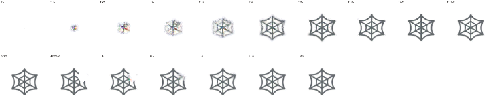

# NCA Morphogenesis

A neural cellular automaton (NCA) that grows a pattern from a single cell, maintains it,
and regrows it after damage, plus a live web sandbox where you can wound the organism,
inject noise and build walls while it runs. Based on
[Growing Neural Cellular Automata](https://distill.pub/2020/growing-ca/)
(Mordvintsev et al., Distill 2020). The default target is the 🕸 spider-web emoji
from Google's Noto Color Emoji font.



*Top: growth from a single seed cell. Bottom: the target, then a randomly wounded
pattern regrowing. Made with `tools/evaluate.py` and the bundled trained model.*

## Features

- **Model**: a lightweight PyTorch NCA. Each cell has 16 channels and perceives its
  neighbours through fixed identity and Sobel filters. A small network shared by all
  cells, two 1×1 convolutions with 8,320 parameters in total, computes each cell's
  update. Living cells update at random times, and a cell dies when no cell in its 3×3
  neighbourhood (itself included) is mature, meaning alpha above 0.1.
- **Training**: grows a target image from one seed pixel. It uses a persistent sample
  pool, and damages samples during training by erasing discs and by injecting noise,
  so the model learns to heal both.
- **Simulation engine**: a fixed-rate server loop that advances the grid frame by frame,
  on PyTorch (CPU, CUDA or Apple MPS) or a NumPy fallback, with walls and brush edits
  applied between steps.
- **Sandbox**: a browser canvas streamed over WebSockets. Erase, inject noise, paint or
  remove walls, and plant extra seeds; pause, single-step, change speed, and switch
  between the RGBA, hidden-channel and alive-mask views.

## Quick start

```bash
python -m venv .venv && source .venv/bin/activate     # Windows PowerShell: .venv\Scripts\Activate.ps1
pip install -r requirements.txt
python server.py                                       # then open http://localhost:8000
```

The sandbox loads the trained model, `checkpoints/spiderweb.npz`, by default. With PyTorch installed
it runs on PyTorch (CUDA when available, otherwise CPU; pass `--device mps` on Apple
silicon), otherwise on NumPy. Both implement the same update rule. To run only the
sandbox, without PyTorch, `pip install numpy starlette "uvicorn[standard]"` is enough.

## Train a model

```bash
python -m nca.train --out checkpoints/my_web.npz             # uses a GPU if one is available
python tools/evaluate.py --checkpoint checkpoints/my_web.npz  # growth, stability, regrowth, noise
python tools/stress_test.py --checkpoint checkpoints/my_web.npz  # robustness beyond training
python server.py --checkpoint checkpoints/my_web.npz
```

The defaults follow the Distill "regenerating" experiment: a 40 px target with 16 px of
padding (a 72×72 grid), 16 channels, 128 hidden units, fire rate 0.5, a pool of 1,024
samples, batch 8, 64-96 steps per rollout, Adam at 2e-3 dropping to 2e-4 after 2,000 of
8,000 iterations, and per-tensor gradient normalisation.

One deliberate difference: Distill erases a disc from 3 samples per batch. Here, 2
samples get a disc erased and 2 more get Gaussian noise (standard deviation 0.1-0.6) on
the living cells inside a disc. The sandbox lets users inject noise, and a model trained
only on erasure does not recover from it (see [Results](#results)).
`--damage 3 --noise-damage 0` gives the original Distill damage recipe.

A second small difference: only cells that are alive at the start of a step may update.
In the Distill code every cell adds its update and dead cells are cleared only at the
end of the step, so an empty cell's momentary update can keep a neighbour alive. Here
that cannot happen, and the PyTorch model, the NumPy version and the bundled checkpoints
all use the same rule (`tests/test_torch_parity.py` checks it).

| flag | what it does |
|---|---|
| `--target path.png` | any RGBA image with a transparent background |
| `--damage N` / `--noise-damage N` | samples per batch erased / noised (both 0 = growing only) |
| `--noise-std lo,hi` | range of the training noise strength |
| `--init model.npz` | start from existing weights (fine-tuning); iteration counts carry over |
| `--resume run.pt` | continue a run; the `.pt` holds weights, optimiser, schedule and pool |
| `--grad-checkpoint` | recompute activations in the backward pass; much less GPU memory |
| `--device cpu\|cuda\|mps` | defaults to the first available |

With `--out checkpoints/my_web.npz` (the default is `checkpoints/run.npz`), training writes
the following to `checkpoints/`:

- `my_web.npz`: the weights the simulator loads.
- `my_web.pt`: the full training state, for `--resume`.
- `my_web_log.json`: the loss at every iteration.
- `my_web_previews/`: a PNG of the batch every `--log-every` iterations.

**On Colab:** upload the zip, switch to a GPU runtime, and run
`!unzip -q nca-morphogenesis.zip && cd nca-morphogenesis && pip install -r requirements.txt && python -m nca.train --out checkpoints/my_web.npz`.

`tools/train_numpy.py` is a NumPy version of the same trainer, with a hand-written
backward pass. It is slow, but it needs no PyTorch and is useful for checking the maths.

## Tests

```bash
python tests/test_torch_parity.py   # PyTorch model == NumPy reference (forward pass and gradients)
python tests/test_gradients.py      # NumPy backward pass vs finite differences
python tests/test_engine.py         # engine, brushes, protocol, WebSocket endpoint
python tests/test_training.py       # noise damage and fine-tuning in the NumPy trainer
```

With pytest installed, `python -m pytest tests -s` runs them all. Run the parity test
before a long training run.

## How the project meets the brief

| requirement | where |
|---|---|
| **NCA architecture**: cellular update rules as a lightweight 2-D conv net in PyTorch | `nca/model.py`: fixed depthwise perception (identity, Sobel x/y), two 1×1 convs (48 → 128 → 16, last layer zero-initialised), stochastic per-cell updates, alive masking on alpha |
| **Training**: grow from one seed pixel with a persistent sample pool and random damage | `nca/train.py`: pool of 1,024, worst sample reseeded, the best get a disc erased (2) or noised (2), backpropagation through 64-96 steps |
| **Simulation engine**: frame-by-frame grid updates, state persistence, temporal flow | `sim/engine.py` (grid state, walls, brushes, PyTorch or NumPy backend) and the fixed-rate loop in `server.py` (pause, single step, steps per frame) |
| **Interactive sandbox and transport**: real-time canvas over WebSockets; inject noise, paint obstacles, erase | `server.py` (Starlette WebSocket), `sim/session.py` (protocol), `web/` (canvas client) |

## Sandbox

| tool | key | effect |
|---|---|---|
| Erase | `E` | zeroes every channel under the brush (a wound) |
| Noise | `N` | adds Gaussian noise to all channels of living cells under the brush (strength = standard deviation) |
| Wall | `W` | paints obstacles: cells forced to zero after every step, so growth has to route around them |
| Unwall | `U` | removes obstacles |
| Seed | `S` | plants a new seed cell where you click, to grow a second organism |

| key | action |
|---|---|
| `Space` | pause / resume |
| `.` | single step |
| `R` | reset to a single seed |
| `D` | erase a random disc over the organism |
| `[` `]` | smaller / larger brush |
| `1` `2` `3` | RGBA view / hidden channels 4-6 as colour / alive mask |

"Steps per frame" sets the simulation speed, and the server streams up to 30 frames per
second (`--fps`). Each browser tab gets its own simulation. Server flags: `--checkpoint`,
`--size` (grid, default 96), `--fps`, `--steps-per-frame`, `--backend auto|torch|numpy`,
`--device`, `--host`, `--port`.

### Wire protocol

Client to server, as JSON text:

- `stroke {tool, points: [[x, y], ...], radius, strength}`
- `pause {value}`, `step {n}`, `speed {steps_per_frame}`, `view {mode}`
- `reset`, `clear`, `clear_walls`, `damage`

Coordinates are in cells and may be fractional, and the client interpolates drags so
strokes have no gaps. Malformed messages get an `error` reply and never end the session.

Server to client:

- a JSON `hello` with the grid size, backend and checkpoint metadata;
- JSON `stats` twice a second;
- one binary frame per tick: a 16-byte header (`NCA1`, step, H, W, view, flags), then
  H×W×4 RGBA bytes with premultiplied colour, then a bit-packed wall mask.

The exact byte layout is documented in `sim/session.py`.

## Project layout

```
nca/model.py          PyTorch NCA (perceive -> update -> stochastic fire -> alive mask)
nca/train.py          PyTorch trainer: pool, erase and noise damage, BPTT, export
nca/numpy_nca.py      the same update rule in NumPy (simulator fallback, reference trainer)
nca/checkpoint.py     framework-neutral .npz weight format shared by everything
nca/target.py         target loading (premultiplied RGBA + padding)
sim/engine.py         grid state, obstacles, brushes, backends
sim/session.py        per-connection protocol and frame encoding
server.py             Starlette app: static client + /ws stream loop
web/                  canvas client (index.html, app.js, style.css)
tools/train_numpy.py  NumPy trainer with a hand-written backward pass
tools/evaluate.py     growth / stability / regeneration / noise metrics and filmstrips
tools/stress_test.py  robustness beyond the training conditions (many seeds, unseen damage)
tests/                parity, gradient, engine/server and training tests
docs/                 sandbox screenshot
data/                 spiderweb_128.png target, rendered from Noto Color Emoji (SIL OFL 1.1)
checkpoints/          spiderweb.npz (trained model) and spiderweb_starter.npz, with training logs and evaluations
```

## Results

`checkpoints/spiderweb.npz` was trained with `python -m nca.train` using the defaults
above (8,000 iterations, 2 erased and 2 noised samples per batch) on an RTX 3050 GPU.
The training loss fell from 0.023 (mean of the first 100 iterations) to 0.00062 (mean
of the last 100). The numbers below come from `python tools/evaluate.py`; they are mean
squared error against the target, and vary a little with the random seed.

| state | MSE |
|---|---|
| empty grid | 0.0296 |
| after 60 / 80 / 200 growth steps | 0.0031 / 0.00059 / 0.00008 |
| left running: step 500 / 1,000 / 2,000 | 0.00006 / 0.00005 / 0.00005 (step 2,000 needs `--long 2000`) |
| 8 random wounds: just after, then +50 and +200 steps (median) | 0.0031, 0.00018, 0.00006 |
| the same 8 wounds: recovered after 200 steps | 7 of 8 (the worst ends at 0.0030) |
| noise 0.1 / 0.3 / 0.6 at the centre: just after | 0.00048 / 0.0036 / 0.0150 |
| the same, 300 steps later | 0.00006 / 0.00006 / 0.00005 |

- **Growth:** the web, inner rings included, forms in about 80 steps and keeps refining.
- **Stability:** the error stays flat from step 1,000 to step 2,000, so there is no drift.
- **Repair:** in the typical case 98% of a wound's extra error is gone after 50 steps, and
  all of it after 100. Not every wound heals, though: one of the 8 here did not, and the
  stress tests below show why.
- **Noise:** even strength 0.6 heals completely within 300 steps.


*The live sandbox with the trained model: a grown web, a strip erased, the web 200 steps
later, noise of strength 0.6 injected, and the web 300 steps later.*

### Beyond the training conditions

`tools/evaluate.py` only uses damage of the kinds and sizes seen in training, so its numbers
are a best case. `python tools/stress_test.py` goes further. It grows 16 webs from
independent random seeds, damages them in ways the model never practised, runs each for
1,000 more steps, and counts a web as recovered when its error ends below twice the
undamaged level.

| test | recovered |
|---|---|
| growth, 16 random seeds | all 16; worst MSE 0.00011 at step 200, 0.00006 at step 5,000 |
| erase a disc of training size (r 4-14 px) | 41 of 48 |
| ...the wound misses the hub (the web's centre) | 33 of 33 |
| ...the wound reaches the hub | 8 of 15 |
| erase a bigger disc (r 16-22 px) | 5 of 16 |
| erase the left half | 16 of 16 |
| erase all but one quarter | 0 of 16 |
| erase a 6 px slot through the centre | 0 of 16 |
| erase the hub (centre disc, r 8 px) | 0 of 16 |
| noise 0.6 near the centre | 16 of 16 |
| noise 1.0 near the centre | 16 of 16 |
| noise 2.0 near the centre | 9 of 16 |
| noise 0.6 over the whole web | 12 of 16 |
| noise 1.0 on the 12 hidden channels only | 1 of 16 |
| grow from 4 off-centre seeds in a 160×160 dish | all 4 (IoU ≥ 0.994, nothing grows outside the web) |

What this shows:

- **Not a quirk of the test.** Results hold across random seeds and over 5,000 steps.
  The web grows the same way anywhere in a larger dish, so it does not depend on the
  grid edges or on starting in the centre.
- **The hub is the weak point.** Every training-sized wound that missed the centre healed
  (33 of 33), and so did cutting off the left half. When the hub is destroyed, the web
  in the runs inspected starts to regrow and then settles into a malformed version.
  Losing most of the web, or scrambling the hidden channels (the cells' internal
  "chemical signals") everywhere, is not recoverable either.
- **Noise:** local noise heals well beyond the training range (strength 1.0 every time),
  but not reliably at 2.0, and noise over the whole web heals in 12 of 16 runs.

This is expected for an NCA: it learns to repair the damage it practised on. More
training, or training wounds aimed at the hub more often, are the obvious next steps.

### Earlier models

`checkpoints/spiderweb_starter.npz` came first. It was trained with the NumPy trainer
(`tools/train_numpy.py`) for 4,000 iterations, using the original erase-only damage, and
the tests use it as a fixed reference model.

| `tools/evaluate.py` measure | NumPy starter | trained model |
|---|---|---|
| grown, step 200 | 0.0027 | 0.00008 |
| left running to step 1,000 | 0.0039 | 0.00005 |
| wound repaired after 200 steps (median) | 86% | 101% |
| noise 0.3 / 0.6, then 300 steps | 0.0050 / 0.0112 | 0.00006 / 0.00005 |

A repair figure above 100% means the error ended slightly lower than before the wound.
The starter never formed the inner rings, slowly thickened when left running, and scarred
under noise. A 1,200-iteration fine-tune of the starter with noise damage improved its noise
healing (0.0045 / 0.0080) but made it drift more (0.0069 at step 1,000), likely because a
short run restarts the sample pool. Training with noise damage from the start, as above,
fixed all three problems.

## Next steps

- Make hub wounds heal reliably: train longer, or aim more training wounds at the centre,
  and check the result with `tools/stress_test.py`.
- Train other emoji (one model each) and add a picker to the sandbox to switch between them.
- Train other targets (any transparent PNG), or a growing-only model (`--damage 0 --noise-damage 0`),
  and compare how each reacts to the same wound in the sandbox.
- Add walls to training (zeroing random rectangles every step), so that obstacle
  avoidance is learned rather than accidental.
- Move inference into the browser (WebGL or WebGPU) to remove the server from the loop.

## References

- A. Mordvintsev, E. Randazzo, E. Niklasson, M. Levin. *Growing Neural Cellular Automata.*
  Distill, 2020. https://distill.pub/2020/growing-ca/
- Spider-web emoji from [Noto Color Emoji](https://github.com/googlefonts/noto-emoji) by Google.
